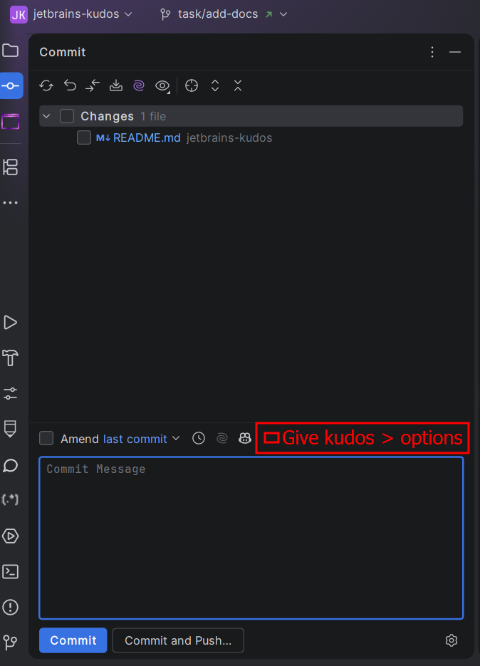

# Kudos

This document describes what Kudos is trying to solve and how it differs from other approaches to attribution.

## How is this Plugin different from other solutions?

### Git AI

Tools like [Git AI](https://usegitai.com/) work by recording metadata about AI-generated changes while an AI Agent is
actively making changes in a codebase.

Combined with Git Hooks, this metadata can be used to automatically add AI attribution to commits.

#### Pros

- Attribution can happen automatically
- If you forget to give credit, the Git Hook can add it for you
- The attribution can be based on actual AI activity recorded by Git AI

#### Cons

- Requires three separate components: Git AI, Git Hooks, and the AI Agent
- If Git AI is not running, the automatic attribution may fail
- Metadata support depends on the AI Agent and tooling being used
- It does not solve attribution for code copied from tools such as ChatGPT or Claude

### Kudos

Kudos takes a deliberately different approach:

**The developer decides.**

Kudos does not attempt to detect whether AI was used or determine who contributed to a change.

Instead, it provides a simple option in the JetBrains commit UI that allows the developer to give credit to whoever or
whatever helped with the change.

For example:

- A teammate
- GitHub Copilot
- Claude
- ChatGPT
- Stack Overflow
- An open-source project
- Documentation
- Anyone else the developer wants to credit

The selected attribution is added directly to the commit message in a standardized format.

#### Pros

- Simple setup
- No Git Hooks required
- No external metadata required
- No AI detection
- Works regardless of how the contribution was made
- Works for AI Agents, humans, websites, documentation, or anything else
- Attribution is controlled by the developer
- The attribution preference can be remembered per repository

#### Cons

- Attribution is not automatic.
- The developer must remember to give Kudos when appropriate.
- The developer is responsible for accurately declaring attribution.

## The principle

Kudos deliberately chooses a low-tech approach:

> **Don't try to determine who contributed. Ask the person making the commit.**

The developer is already responsible for reviewing and accepting the changes. They are therefore also the person best
placed to decide who deserves credit for them.

## Plugin Design

The plugin should initially integrate with the JetBrains Commit Tool Window:

> Every commit will receive attribution until either:
> - The `Give Kudos` checkbox is deselected
> - The Commit Tool Window Kudos section is disabled

### Commit Tool Window

The Commit Tool Window should provide:

- A checkbox labelled `Give Kudos`
- A drop-down tray containing the configured collaborator options
  - The tray should support scrolling if there are more options than can be displayed comfortably
- The `Give Kudos` setting should be remembered globally across JetBrains IDEs, rather than being stored per repository

When `Give Kudos` is enabled, the selected collaborator should be added to the commit message in the appropriate
attribution format.

### Kudos Tool Window

Kudos should also provide a dedicated Tool Window for configuration.

The Tool Window should allow the user to:

- Enable or disable the Kudos UI in the Commit Tool Window
  - When disabled, the UI should provide a tooltip explaining that Kudos is currently disabled
- Edit the available collaborator options
  - Collaborators should be represented as a map where
    - The key is the collaborator's display name/description
    - The value is the collaborator's email address, or `null` when no email address is available
- Preview how the attribution will look. Default: `collaborator <collaborationEmail>
- Reset the collaborator options to the default values
